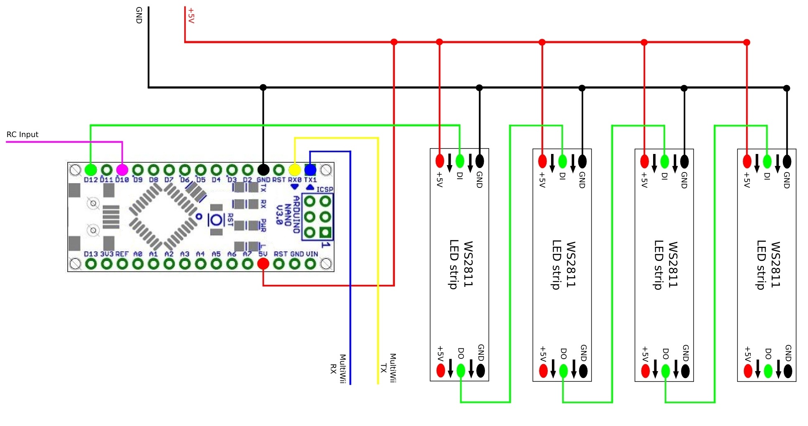

MultiCopterLightControl-Lite v0.1-proof-of-concept
============================

MCLC-Lite ist ein OpenSource Projekt um ein WS2811 RGB LED Strip mit einem Arduino zu steuern.
Es basiert auf dem MultiCopterLightControl-Projekt von DLArts.[https://github.com/DLArts/MultiCopterLightControl]
Das Hauptziel, des Projekts ist die Darstellung und Steuerung von unterschiedlichen Lichteffekten für MultiCopter. 

Das Projekt befindet sich noch in der anfänglichen Entwicklungsphase, und besteht gröchstenteils aus dem MCLC-Projekt, welches ich hiermit aber in einer leicht abgewandelten Version anbieten möchte.

Hierbei handelt es sich um KEINE Eigenentwicklung meinerseits, ich habe die Software nur auf meine Bedürfnisse angepasst und möchte sie von diesem Stand weiterentwickeln.

Genau wie das MCLC-Projekt basiert diese Version auf der FastSPI_LED2 Bibliothek.

Nun werde ich in Kürze die Anforderungen, die Code-Struktur, die Effekte und die Einstellungen erklären.

Anforderungen
=============
Um den Sketch zu kompilieren, sind neben der aktuellen Arduino IDE, zwei Bibliotheken erforderlich: 
<b>SerialCommand</b>: <a>https://github.com/kroimon/Arduino-SerialCommand</a>  
<b>FastSPI_LED2</b>: <a>http://code.google.com/p/fastspi/</a> 

An Hardware wird neben einem Arduino natürlich auch ein WS2811 RGB_LED-Strip benötigt zusätzlich ist ein PWM-Kanal eines Flugtransmitters notwendig.

Ich persönlich benutzte einen Arduino Nano v3 und einen D8R-II-Plus (geflasht auf XP).
Als Test-Konfiguration benutzte ich einen Quadrocopter mit jeweils 14 LEDs pro Arm.

Am MultiCopter sollte der LED-Strip mit einem BEC mit 5V versorgt werden.
Je nach Anzahl der LEDs ist die maximale Stromstärke des BEC zu wählen.
Maximal braucht jede LED bei voller Helligkeit und weisser Lichtfarbe 60mA.
D.h. in meiner Test-Konfiguration mit 4 Armen mit je 6 LEDs (=24 LEDs) werden 24*60mA = 1440 mAh, also etwa 1,5 A benötigt.

Zur Verkabelung möchte ich eine Zeichnung von DLArts/MultiCopterLightControl zeigen.

Die Zeichnung verwendet die Standard-Pins in der 'config.h'.
Der LED-Pin als auch der RC-Pin können in der 'config.h' angepasst werden.
Der Anschluss eines RC-Empfängers oder MultiWii-boards muss hierbei weggedacht werden, da ich diese Funktion in meiner "lite"-version nicht für nötig erachte.  

Code-Struktur
=============
Der Quellcode ist in mehere Dateien unterteilt.

<b>MultiCopterLightControl.ino</b> 
Hauptdatei mit setup() und loop() Methoden. Hier werden auch die Lichteffekte aufgerufen.
In dieser Datei sind auch die grundlegenden Methoden zur Ansteuerung der LEDs implementiert.

<b>LedEffects.ino</b> 
Diese Datei beinhaltet die Methoden, welche spezielle Lichteffekte realisieren.

<b>Colors.ino</b> 
Hier wird die Farbverwaltung realisiert.
Das Projekt verwendet eine Farbpalette von maximal 16 Farben.
Diese 16 Farben können vollkommen frei definiert werden.
Zusätzlich können 8 verschiedene Led-Konfigurationen gespeichert werden.
Jeder LED wird hier jeweils ein Farbe aus der Farbpalette zugeordnet.
Diese Art der Farbverwaltung benötigt sehr wenig Speicherplatz und ermöglicht in Zukunft einige interessante Effekte.

<b>config.h</b> 
Diese Datei ist angelehnt an die MultiWii Software.
Diese Datei muss entsprechend euren Anforderungn angepasst werden.

<b>InputRC.ino</b> 
Hiermit kann ein Kanal eines RC-Empfänger als Steuerung benutzt werden.
Dazu wird der Empfänger an den entsprechen Pin angeschlossen, welcher in der Datei config.h eingestellt werden kann.
In dieser Version gibt es, anders bei MCLC, 7 verschiedene modi, welche aber leicht ergänzt und verändert werden können.

Einstellungen
=============

Generelle Einstellungen

<b>NUM_ARMS</b>        = Anzahl der Arme eures Multikopters 
<b>LEDS_PER_ARM</b>    = Anzahl der LEDs pro Arm 
<b>LED_PIN</b>         = Digitaler Arduino PIN, an welcher der erste LED-Strip angeschlossen werden muss 

LED-Effekte
===========

<b>oneColor(CRGB color, int DELAY)</b> 
Auf allen LEDs wird eine Farbe dargestellt.

<b>showCurrentColors(int iConfig, int DELAY)</b> 
Die LEDs leuchten in den Farben entsprechend der gewählten Konfiguration.

<b>police(CRGB color1, CRGB color2, int DELAY)</b> 
Die LEDs blinken (pro Arm) abwechseln in den beiden angebenen Farben.

<b>runningLed(int iConfig, CRGB* blinkColor, int blinkDelay, boolean bounce, int length, int DELAY)</b> 
Ein LED-Streifen läuft von aussen nach innen (auf jedem Arm) bzw. wieder zurück.
Es muss eine LED-Konfiguration angegeben werden, sodass die LEDs in den entsprechenden Farben leuchten.
"blinkColor" kann NULL sein, oder man gibt explizit eine Farbe an.
Falls "blinkDelay" > 0 ist, wird am Ende einer Animation (wenn der LED-Streifen die Arm-Enden erreicht) ein Blitz ausgelöst.
Falls "blinkColor" NULL ist, wird für den Blitz die Farben der Konfiguration benutzt, ansonsten blitzen alle LEDs in der gewählten Farbe auf.
"bounce" gibt an, ob der Streifen hin und her laufen soll, oder nur von innen nach aussen.
"length" gibt die Länge des LED-Streifens an, welcher hin und her läuft.

<b>showBrightness(int iConfig, int brightness, int DELAY)</b> 
Stellt die Farben der gewählten Konfiguration mit einer gewählten Helligkeit dar.

<b>pulseBrightness(int iConfig, int startBrightness, int endBrightness, int steps, int DELAY)</b> 
Fadet die Helligkeit der LEDs zwischen den beiden gewählten Werte.
Auch hier muss wieder eine Konfiguration angegeben werden.
"steps" gibt an, wie fein/grob das Fading sein soll.

rainbow_fade

rainbow_loop

Hilfreiche Links zum Thema WS2811/WS2812/NeoPixel
=================================================
Die hier verwendete Bibliothek FastLED bzw. deren Wiki, insbesondere die Abschnitte "Wiring leds" und "Power notes" sind wichtig und lesenswert:  
https://github.com/FastLED/FastLED/wiki/Wiring-leds 
https://github.com/FastLED/FastLED/wiki/Power-notes 

Adafruit Guide zu den NeoPixels, insbesondere die Abschnitte "Best Practices" und "Powering NeoPixels" sind wichtig und lesenswert: 
https://learn.adafruit.com/adafruit-neopixel-uberguide/best-practices 
https://learn.adafruit.com/adafruit-neopixel-uberguide/power 

Beschreibung und Tipps zu der Teensy-Bibliothek OctoWS2811: 
http://www.pjrc.com/teensy/td_libs_OctoWS2811.html 

Ich kann jedem der sich für LEDs interessiert auch nur die Google+ Seite von FastLED empfehlen. Hier findet man immer wieder neue Anregeungen und kreative Ideen, was man mit LEDs alles machen kann: 
https://plus.google.com/communities/109127054924227823508 

MCLC-Projekt 
https://github.com/DLArts/MultiCopterLightControl/

